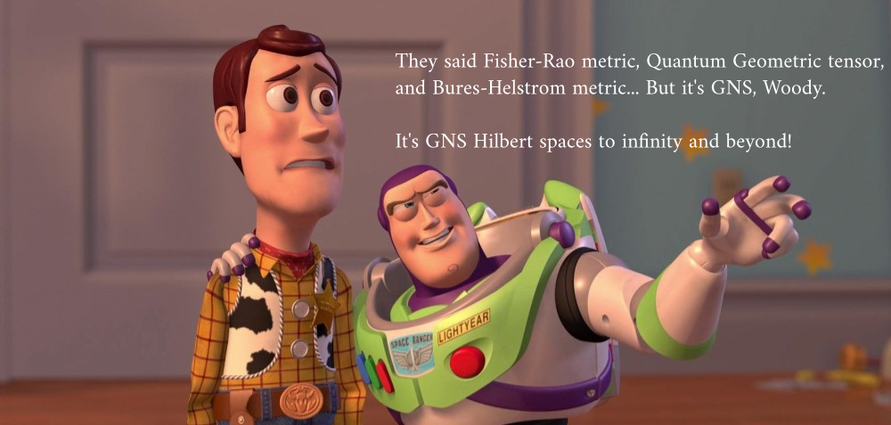
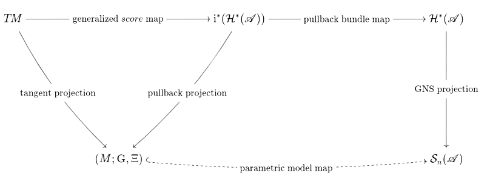

## $\;$ Look: it's GNS Hilbert spaces everywhere! {background-color="beige"}

###  $\qquad$ Information geometry _via_ GNS construction

::: {style="text-align:center;"}
Florio M. Ciaglia
:::

::: {style="text-align:center;"}
Universidad Carlos III de Madrid
:::

::: {style="text-align:center;"}
**GEOMETRY AND DYNAMICS** · Naples · 14-16 January 2026
:::

::: {style="text-align:center;"}
Joint work in collaboration with:
:::

::: {style="text-align:center;"}
:::: {.columns}
::: {.column width="33%"}
M. Castrillón (UCM)
:::
::: {.column width="33%"}
L. E. González-Bravo (UCM) 
:::
::: {.column width="33%"}
A. Ibort (UC3M)
:::
::::
:::

 

## Very informal take-home message {background-color="beige"}

## Classical models  {background-color="beige"}

**Parametric statistical model** on the measure space $(\Omega,\mu)$:
$$
\mathrm{i}\colon\Theta\subseteq\mathbb{R}^{n}  \hookrightarrow  \mathcal{P}(\Omega)
$$
$$
(\theta^1,\dots,\theta^n)\equiv \theta 
\mapsto \mathrm{i}(\theta)= \mathrm{p}_{\theta}(A)=\int_{A}p(\theta;\omega)\,\mathrm{d}\mu(\omega)
$$

**Score functions**:
$$
s_{j}(\theta;\omega):=\partial_{\theta^j}\log p(\theta;\omega)\,\in\;\mathcal{L}^{2}(\Omega,\mathrm{p}_{\theta})
$$

**Fisher-Rao metric**:

$$
g^{\mathrm{FR}}_{jk}(\theta)=\int_{\Omega} s_{j}(\theta;\omega)\,s_{k}(\theta;\omega)\,  p(\theta;\omega)\,d\mu(\omega)
=
\mathbb{E}_{p_\theta}[s_{j} \,s_{k}]
$$
 
 <!--
 **Amari-Čencov tensor**:

$$
T_{jkl}^{\mathrm{AC}}(\theta)=\int_{\Omega} s_{j}(\theta;\omega)\,s_{k}(\theta;\omega)\,s_{l}(\theta;\omega)\,  p(\theta;\omega)\,d\mu(\omega)=
\mathbb{E}_{p_\theta}[s_{j}\, s_{k}\,s_{l}]
$$
-->

## Pure Quantum models   {background-color="beige"}

**Parametric model** of normalized vectors on the Hilbert space of the system:
$$
\mathrm{i}\colon \Lambda\subseteq\mathbb{R}^{n} \hookrightarrow \mathcal{H}
$$

$$
(\lambda^1,\dots,\lambda^n)= \lambda \mapsto \mathrm{i}(\lambda)=\psi(\lambda) \in \mathcal{H},\quad \langle \psi(\lambda)|\psi(\lambda)\rangle = 1
$$

**Quantum geometric tensor (QGT)**:
$$
Q_{ij}(\lambda) = \langle \partial_i \psi(\lambda), \partial_j \psi(\lambda)\rangle - \langle \partial_i \psi(\lambda), \psi(\lambda)\rangle
  \langle \psi(\lambda), \partial_j \psi(\lambda)\rangle
$$

:::: {.columns}
::: {.column}
**Fubini-Study metric** (**symmetric part**):
$$
g_{ij}^{\mathrm{FS}}(\lambda)= \Re Q_{ij}(\lambda)
$$
:::
::: {.column}
**Berry curvature** (**anti-symmetric part**):
$$
\varpi_{ij}(\lambda)= \Im Q_{ij}(\lambda)
$$

:::
::::

## Faithful Quantum models  {background-color="beige"}

 **Parametric model** of invertible density operators on the Hilbert space of the system:
$$
\mathrm{i}\colon \Lambda\subseteq\mathbb{R}^{n} \hookrightarrow \mathcal{B}_{1}(\mathcal{H})
$$

$$
(\lambda^1,\dots,\lambda^n)= \lambda \mapsto \mathrm{i}(\lambda)=\rho(\lambda) \in \mathcal{B}_{1}(\mathcal{H}),\quad \rho(\lambda)>0,\quad \mathrm{Tr}_{\mathcal{H}}(\rho(\lambda))=1
$$

**Symmetric Logarithmic Derivatives (SLDs)**:

$$
\frac{\partial \rho(\lambda)}{\partial \lambda^{j}}=\{\rho(\lambda),\mathbf{L}_{j}(\lambda)\}=\frac{1}{2}\left(\rho(\lambda)\,\mathbf{L}_{j}(\lambda) + \mathbf{L}_{j}(\lambda)\,\rho(\lambda)\right) 
$$

**Bures-Helstrom (Quantum Fisher) metric**

$$
g_{jk}^{\mathrm{BH}}(\lambda)=\mathrm{Tr}_{\mathcal{H}}\left(\rho(\lambda)\left\{\mathbf{L}_{j}(\lambda), \mathbf{L}_{k}(\lambda)\right\}\right)=\Re \mathrm{Tr}_{\mathcal{H}}\left(\rho(\lambda)\,\mathbf{L}_{j}(\lambda)\, \mathbf{L}_{k}(\lambda)\right)
$$

## Complex numbers on steroids: $C^*$-algebras  {background-color="beige"}

:::: {.columns}

::: {.column}

The **Classical**: 

- $\mathcal{L}^{\infty}(\Omega,\mu)$ is an Abelian $C^*$-algebra
- $\mathcal{L}^{1}(\Omega,\mu)$ is its predual

:::

::: {.column}
The **Quantum**:

- $\mathcal{B}(\mathcal{H})$ is a non-Abelian $C^*$-algebra
- $\mathcal{B}_{1}(\mathcal{H})$ is its predual
:::

::::

A complex **Banach algebra** $\mathscr{A}=(A,+,\cdot,\Vert \cdot \Vert)$ with:

- **Involution** (anti-linear, continuous): $\mathbf{x}\mapsto\mathbf{x}^{\dagger}\mid (\mathbf{x}^{\dagger})^{\dagger}=\mathbf{x}$
- **$C^{*}$-identity**: $\Vert\mathbf{x}^{\dagger}\,\mathbf{x}\Vert = \Vert\mathbf{x}\Vert^{2}\;\Longleftrightarrow\;\Vert\mathbf{x}\,\mathbf{x}^{\dagger}\Vert = \Vert\mathbf{x}\Vert\; \Vert\mathbf{x}^{\dagger}\Vert$

Define:

:::: {.columns}
::: {.column}
- **self-adjoint** part $\mathscr{A}_{sa}=\left\{\mathbf{x}^{\dagger}=\mathbf{x}\right\}$
- **antiself-adjoint** part $i\mathscr{A}_{sa}=\left\{\mathbf{x}^{\dagger}=-\mathbf{x}\right\}$

:::

::: {.column}
- **unitary** part $\mathcal{U}(\mathscr{A}):=\left\{\mathbf{u}\mid \mathbf{uu}^{\dagger}=\mathbf{u}^{\dagger}\mathbf{u}=\mathbb{I}\right\}$
- **non-negative** part $\mathscr{A}_{+}:=\left\{\mathbf{p}\mid\mathbf{p}=\mathbf{xx}^{\dagger}\right\}$
:::
::::

Life's easier when $\mathscr{A}$ is a **$W^{*}$-algebra** (_i.e._, it is the Banach dual space of some $\mathscr{A}_{*}$)

## Classical and quantum states revisited  {background-color="beige"}

The **space of states** $\mathcal{S}(\mathscr{A})$ of $\mathscr{A}$ is the convex set^[Every $W^{*}$-algebra has an identity element $\mathbb{I}$.]:
$$
\mathcal{S}(\mathscr{A}):=\left\{\rho\in\mathscr{A}_{sa}^{*}\mid \rho(\mathbf{aa}^{\dagger})\geq 0, \;\Vert\rho\Vert_{\mathscr{A}^{*}} =1\,=\rho(\mathbb{I})\right\}
$$

We focus on the space of **normal states** $\mathcal{S}_{n}(\mathscr{A})$, whose elements "live" in $(\mathscr{A}_{sa})_{*}\subseteq \mathscr{A}_{sa}^{*}$.

 

:::: {.columns}

::: {.column}

The **Classical**  space of normal states:
$$
\mathcal{P}_{\mu}(\Omega)=\left\{p\mu\mid p\in\mathcal{L}^{1}_{+}(\Omega,\mu) ,\;p\mu(\Omega)=1\right\}
$$
$$
p\mu(f)=\int_{\Omega}f(\omega)\,p(\omega)\,\mathrm{d}\mu(\omega)
$$

:::

::: {.column}
The **Quantum** space of normal states:
$$
\mathcal{S}_{n}(\mathcal{H})=\left\{\rho\in\mathcal{B}_{1}(\mathcal{H})\mid \rho\geq 0, \; \rho(\mathbb{I})=1\right\}
$$
$$
\rho(\mathbf{a})=\mathrm{Tr}_{\mathcal{H}}\left(\rho\,\mathbf{a}\right)
$$
:::
::::

 

## What Is$\stackrel{\mathbf{Not}}{\curlyvee}$ <ruby><s>and</s><rt>but</rt></ruby> What Should <ruby><s>Never</s><rt>Always</rt></ruby> Be^[A beer to the first one who [gets it](https://www.youtube.com/watch?v=WnMiXsRtsfc).]  {background-color="beige"}

**Classical**/**Quantum** parametric models in one stroke: 
$$
\mathrm{i}\colon M\hookrightarrow \mathcal{S}_{n}(\mathscr{A})
$$

Imagine we find a Riemannian metric $\mathrm{G}$ on $\mathcal{S}_{n}(\mathscr{A})$ such that

$$
\mathrm{i}^{*}\mathrm{G}=\left\{\begin{matrix} g^{\mathrm{FR}} & \mbox{ when } \mathscr{A}=\mathcal{L}^{\infty}(\Omega,\mu) & \\ & & \\ g^{\mathrm{FS}} & \mbox{ when } \mathscr{A}=\mathcal{B}(\mathcal{H}), & \mathrm{i}(m)\equiv\rho_{m} \mbox{ is pure} \\ & & \\ g^{\mathrm{BH}} & \mbox{ when } \mathscr{A}=\mathcal{B}(\mathcal{H}), & \mathrm{i}(m)\equiv\rho_{m} \mbox{ is faithful} \end{matrix}\right.
$$

We would be very happy...

## Obviously, $\mathcal{S}_{n}(\mathscr{A})$ is **not** a manifold! {background-color="beige"}

{.absolute right="300" height="600"}

## How to pullback metrics  {background-color="beige"}

We need an immersion:

$$
\mathrm{i}\colon M \hookrightarrow N
$$

We need tangent bundles:

$$
TM=\sqcup_{m\in M} T_{m}M, \qquad
TN=\sqcup_{n\in N} T_{n}N 
$$

We need immersions of tangent spaces:

$$
T_{m}M\ni v_{m}\,\mapsto\,T_{m}\mathrm{i}(v_{m})\in T_{\mathrm{i}(m)}N
$$

We need real Hilbert spaces at each $n\in N$:

$$
\mathrm{G}_{n}(v_{n},v_{n})\geq 0 
$$

We then define:
$$
(\mathrm{i}^{*}\mathrm{G})_{m}(v_{m},v_{m}):=\mathrm{G}_{\mathrm{i}(m)}\left(T_{m}\mathrm{i}(v_{m}),T_{m}\mathrm{i}(v_{m})\right)
$$

## From the $\mathrm{GNS}$ space to... {background-color="beige"}

Define the _Gel'fand ideal_
$$
\mathscr{N}_{\rho}:=\left\{\mathbf{a}\in\mathscr{A}\mid\rho(\mathbf{a}^{\dagger}\mathbf{a})=0\right\}.
$$

Define the $\mathrm{GNS}$ Hilbert space as 
$$
\mathcal{H}_{\rho}^{\mathbb{C}}:=\overline{\mathscr{A}/\mathscr{N}_{\rho}}^{\langle\cdot|\cdot\rangle_{\rho}},\qquad \psi_{\mathbf{a}}^{\rho}\equiv[\mathbf{a}]_{\rho},\qquad \langle \psi_{\mathbf{a}}^{\rho}\mid \psi_{\mathbf{b}}^{\rho}\rangle_{\rho}:=\rho(\mathbf{a}^{\dagger}\mathbf{b})
$$

The **classical** case:
$$
p\mu(f)=\int_{\Omega}f(\omega)\,p(\omega)\,\mathrm{d}\mu(\omega) \qquad \rightsquigarrow\qquad
\mathcal{H}_{p\mu}^{\mathbb{C}}\cong\mathcal{L}^{2}(\Omega,p\mu)
$$

The **quantum case**:
$$
\rho(\mathbf{a})=\mathrm{Tr}_{\mathcal{H}}(\rho\,\mathbf{a}) \qquad \rightsquigarrow\qquad \mathcal{H}_{\rho}^{\mathbb{C}}\cong \mathrm{HS}(\mathrm{ran}(\rho),\mathcal{H})
$$

## ... "co/tangent bundle" of $\mathcal{S}_{n}(\mathscr{A})$ {background-color="beige"}

Consider the realification $\mathcal{H}_{\rho}$ of $\mathcal{H}_{\rho}^{\mathbb{C}}$ with

$$
\qquad (\psi^{\rho}\mid\eta^{\rho})_{\rho}:=\frac{1}{2}\left(\langle\psi^{\rho}\mid\eta^{\rho}\rangle_{\rho} + \langle\eta^{\rho}\mid\psi^{\rho}\rangle_{\rho}\right)=\Re \langle\psi^{\rho}\mid\eta^{\rho}\rangle_{\rho} .
$$

Define the "**co/tangent $\mathrm{GNS}$ bundles**"^[Fell-Doran Vol.1.3.18 assure us that these are (non-locally-trivial) Hilbert bundles.]:
$$
\mathcal{H}(\mathscr{A})=\sqcup_{\rho\in\mathcal{S}_{n}(\mathscr{A})}\mathcal{H}_{\rho}\,\stackrel{(\psi^{\rho}\mapsto \rho)}{\longrightarrow} \mathcal{S}_{n}(\mathscr{A})
$$
$$
\mathcal{H}^{*}(\mathscr{A})=\sqcup_{\rho\in\mathcal{S}_{n}(\mathscr{A})}\mathcal{H}_{\rho}^{*}\,\stackrel{(\eta^{\rho}\mapsto \rho)}{\longrightarrow} \mathcal{S}_{n}(\mathscr{A})
$$
with **tautological sections**:
$$
\begin{split}
\rho&\mapsto s_{\mathbf{a}}(\rho)=\psi_{\mathbf{a}}^{\rho}\\
& \\
\rho&\mapsto s^{*}_{\mathbf{a}}(\rho)=\eta^{\mathbf{a}}_{\rho}\mid \eta^{\mathbf{a}}_{\rho}(\psi_{\mathbf{b}}^{\rho})=\left( \psi_{\mathbf{a}}^{\rho}\mid \psi_{\mathbf{b}}^{\rho}\right)_{\rho}
\end{split}
$$

## Transformations properties {background-color="beige"}

The nCPU map 
$$
\Phi\colon \mathscr{B}\rightarrow \mathscr{A}
$$ 
such that 
$$
\mathcal{S}_{n}(\mathscr{A})\ni \rho \mapsto \sigma=\Phi^{*}\rho\in \mathcal{S}_{n}(\mathscr{B})
$$ 
leads to
$$
\tilde{\Phi}\colon \mathcal{H}_{\sigma}\rightarrow\mathcal{H}_{\rho},\qquad
\psi_{\mathbf{b}}^{\sigma}\,\mapsto \, \tilde{\Phi}(\psi_{\mathbf{b}}^{\sigma}):=\psi_{\Phi(\mathbf{b})}^{\rho}
$$
which means $\mathcal{H}(\mathscr{A})$ has contravariant/cotangent flavour, and to
$$
\tilde{\Phi}^{\dagger}\colon \mathcal{H}_{\rho}^{*}\rightarrow\mathcal{H}_{\sigma}^{*},\qquad
\eta^{\mathbf{a}}_{\rho}\,\mapsto \, \tilde{\Phi}^{\dagger}(\eta^{\mathbf{a}}_{\rho})\mid \tilde{\Phi}^{\dagger}(\eta^{\mathbf{a}}_{\rho})(\psi_{\mathbf{b}}^{\sigma})= \eta^{\mathbf{a}}_{\rho}(\psi_{\Phi(\mathbf{b})}^{\rho})
$$
which means $\mathcal{H}^{*}(\mathscr{A})$ has covariant/tangent flavour.

<!---
## ... and to the "Tangent bundle" of $\mathcal{S}_{n}(\mathscr{A})$ {background-color="beige"}

We dualize
$$
\mathcal{H}^{*}(\mathscr{A})=\sqcup_{\rho\in\mathcal{S}_{n}(\mathscr{A})}\mathcal{H}_{\rho}^{*}\,\stackrel{(\psi_{\rho}\mapsto \rho)}{\longrightarrow} \mathcal{S}_{n}(\mathscr{A})
$$
to get covariant/tangent flavour.

There is $\mathsf{I}_{\rho}\colon \mathscr{A}_{sa}\rightarrow \mathcal{H}_{\rho}$  given by 
$$
\mathsf{I}_{\rho}(\mathbf{a}):=\psi_{\mathbf{a}}^{\rho}
$$
The dual space $\mathcal{H}_{ \rho}^{*}$ splits as^[Note that $\mathscr{V}_{\rho}$ is in one-to-one correspondence with $\mathcal{V}_{\rho}$, but it need not be closed in $\mathscr{A}_{sa}^{*}$.]
$$
\mathcal{H}_{\rho}^{*}=\mathrm{Ker}(\mathsf{I}_{\rho}^{*})\oplus \mathrm{Ker}(\mathsf{I}_{\rho}^{*})^{\perp}\equiv \mathcal{K}_{\rho} \oplus \mathcal{V}_{\rho},
$$
$$
\mathscr{V}_{\rho}:=\mathsf{I}_{\rho}^{*}(\mathcal{V}_{\rho}).
$$

Using Riesz's theorem,  $\mathcal{V}_{\rho}$ is isomorphic to  $\mathsf{I}_{\rho}(\mathscr{A}_{sa})\subseteq\mathcal{H}_{\rho}$.
-->

## Regular parametric models  {background-color="beige"}

A **_regular parametric model_** is a triple $(\mathscr{A},\mathrm{i},M)$ where:

- $\mathscr{A}$ is a $W^*$-algebra

- $M$ is a smooth manifold

- $\mathrm{i}\colon M\hookrightarrow \mathcal{S}(\mathscr{A})$ is (injective) **_continuous_** in the weak*-topology

- every $v_{m}\in T_{m}M$ is uniquely represented^[Uniqueness is obtained imposing $\eta^{v_{m}}_{\mathrm{i}(m)}$ vanishes on the subspace generated by anti-self-adjoint elements.] in $\mathcal{H}_{\mathrm{i}(m)}^{*}$:

$$
\frac{\mathrm{d}}{\mathrm{d}t}\left(\mathrm{i}(\gamma_{m}^{v_{m}}(t))(\mathbf{a})\right)_{t=0}=\eta^{v_{m}}_{\mathrm{i}(m)}(\psi_{\mathbf{a}}^{\mathrm{i}(m)})= \left(\tilde\eta_{v_{m}}^{\mathrm{i}(m)}|\psi_{\mathbf{a}}^{\mathrm{i}(m)}\right)_{\mathrm{i}(m)}
$$
where $\gamma_{m}^{v_{m}}(t)$ is a defining curve for $v_{m}$, and $\mathbf{a}\in\mathscr{A}_{sa}$

## Scores (revisited) {background-color="beige"}

Assume $(\mathcal{L}^{\infty}(\Omega,\mu),\mathrm{i},\Theta\subseteq \mathbb{R}^{n})$ is a **_regular parametric model_** ($p(\theta;\omega)>0$ $\mu$-a.e., and $f\in\mathscr{A}_{sa}$):
$$
\theta\,\mapsto \mathrm{i}(\theta)(f)=\int_{\Omega}f(\omega)\,p(\theta;\omega)\,\mathrm{d}\mu(\omega)
$$

For $v_{\theta}^{j}\equiv \left.\partial_{\theta^{j}}\right|_{\theta}$ we have
$$
\begin{split}
\frac{\mathrm{d}}{\mathrm{d}t}\left(\mathrm{i}(\gamma_{\theta}^{v_{\theta}^{j}}(t))(f)\right)_{t=0}&= \int_{\Omega}f(\omega)\,\partial_{\theta^{j}}p(\theta;\omega)\,\mathrm{d}\mu(\omega) \\
\parallel \quad\; \qquad&=  \int_{\Omega}f(\omega)\,\left(\partial_{\theta^{j}}\log p(\theta;\omega)\right)\,p(\theta;\omega)\,\mathrm{d}\mu(\omega) \\
\left(\tilde\eta_{v_{\theta}^{j}}^{\mathrm{i}(\theta)}|\psi_{f}^{\mathrm{i}(\theta)}\right)_{\mathrm{i}(\theta)}  &=\int_{\Omega} f(\omega)\,\tilde\eta_{v_{\theta}^{j}}^{\mathrm{i}(\theta)}(\omega)\,p(\theta;\omega)\,\mathrm{d}\mu(\omega)
\end{split}
$$
which means
$$
v_{\theta}^{j}\equiv \left.\partial_{\theta^{j}}\right|_{\theta}\;\rightsquigarrow\;\tilde\eta_{v_{\theta}^{j}}^{\mathrm{i}(\theta)}(\omega)\equiv s_{j}(\theta;\omega)\in\mathcal{L}^{2}(\Omega,p_{\theta}\mu)
$$

## SLDs (revisited) {background-color="beige"}

Assume $(\mathcal{B}(\mathcal{H}),\mathrm{i},\Lambda\subseteq \mathbb{R}^{n})$ is a **_regular parametric model_** with $\mathrm{dim}(\mathcal{H})<\infty$, $\rho(\lambda)>0$, and $\mathbf{a}=\mathbf{a}^{\dagger}$:
$$
\lambda\;\mapsto\;\mathrm{i}(\lambda)(\mathbf{a})=\mathrm{Tr}_{\mathcal{H}}\left(\rho(\lambda)\,\mathbf{a}\right)
$$

For $v_{\lambda}^{j}\equiv\left.\partial_{\lambda^{j}}\right|_{\lambda}$   we have
$$
\begin{split}
\left(\tilde\eta_{v_{\lambda}^{j}}^{\mathrm{i}(\lambda)}|\psi_{\mathbf{a}}^{\mathrm{i}(\lambda)}\right)_{\mathrm{i}(\lambda)}  &= \frac{1}{2}\mathrm{Tr}_{\mathcal{H}}\left(\rho(\lambda)\,\tilde\eta_{v_{\lambda}^{j}}^{\mathrm{i}(\lambda)}\,\mathbf{a} + \rho(\lambda)\,\mathbf{a}\,\tilde\eta_{v_{\lambda}^{j}}^{\mathrm{i}(\lambda)}\right)\\
\parallel \quad \; \qquad &=\mathrm{Tr}_{\mathcal{H}}\left(\{\rho(\lambda),\tilde\eta_{v_{\lambda}^{j}}^{\mathrm{i}(\lambda)}\}\,\mathbf{a}\right) \\
\frac{\mathrm{d}}{\mathrm{d}t}\left(\mathrm{i}(\gamma_{\lambda}^{v_{\lambda}^{j}}(t))(\mathbf{a})\right)_{t=0}&=\mathrm{Tr}_{\mathcal{H}}\left(\partial_{\lambda^{j}}\rho(\lambda)\,\mathbf{a}\right)
\end{split}
$$
which means
$$
v_{\lambda}^{j}\equiv \left.\partial_{\lambda^{j}}\right|_{\lambda}\;\rightsquigarrow\;\partial_{\lambda^{j}}\rho(\lambda)=\{\rho(\lambda),\tilde\eta_{v_{\lambda}^{j}}^{\mathrm{i}(\lambda)}\}\equiv \{\rho(\lambda),\mathbf{L}_{j}(\lambda)\}
$$

## Pure SLDs {background-color="beige"}

Assume $(\mathcal{B}(\mathcal{H}),\mathrm{i},\Lambda\subseteq \mathbb{R}^{n})$ is a **_regular parametric model_** with $\rho(\lambda)=|\psi(\lambda)\rangle\langle\psi(\lambda)|$, and $\mathbf{a}=\mathbf{a}^{\dagger}$:
$$
\lambda\;\mapsto\;\mathrm{i}(\lambda)(\mathbf{a})=\mathrm{Tr}_{\mathcal{H}}\left(\rho(\lambda)\,\mathbf{a}\right)
$$

For $v_{\lambda}^{j}\equiv\left.\partial_{\lambda^{j}}\right|_{\lambda}$   we have
$$
\begin{split}
\frac{\mathrm{d}}{\mathrm{d}t}\left(\mathrm{i}(\gamma_{\lambda}^{v_{\lambda}^{j}}(t))(\mathbf{a})\right)_{t=0}&=\partial_{\lambda^{j}}\mathrm{Tr}_{\mathcal{H}}\left(\rho(\lambda)\,\mathbf{a}\right) =  \partial_{\lambda^{j}}\left(\langle\psi(\lambda)|\mathbf{a}|\psi(\lambda)\rangle  \right)\\
\parallel \qquad \qquad &= \langle\partial_{\lambda^{j}}\psi(\lambda)|\mathbf{a}|\psi(\lambda)\rangle + \langle\psi(\lambda)|\mathbf{a}|\partial_{\lambda^{j}}\psi(\lambda)\rangle \\
 \left(\tilde\eta_{v_{\lambda}^{j}}^{\mathrm{i}(\lambda)}|\psi_{\mathbf{a}}^{\mathrm{i}(\lambda)}\right)_{\mathrm{i}(\lambda)}  
\end{split}
$$
which means^[Recall that $\rho(\lambda)(\mathbf{I})=\langle\psi(\lambda)|\psi(\lambda)\rangle =1$ implies $\Re \langle\partial_{\lambda^{j}}\psi(\lambda)|\psi(\lambda)\rangle=0$.]
$$
v_{\lambda}^{j}\equiv \left.\partial_{\lambda^{j}}\right|_{\lambda}\;\rightsquigarrow\;\tilde\eta_{v_{\lambda}^{j}}^{\mathrm{i}(\lambda)}=\psi_{\mathbf{b}_{\lambda}^{j}}^{\mathrm{i}(\lambda)} \;\mbox{ with } \frac{\mathbf{b}_{\lambda}^{j}}{2}=|\partial_{\lambda^{j}}\psi(\lambda)\rangle\langle \psi(\lambda)| + | \psi(\lambda)\rangle\langle \partial_{\lambda^{j}}\psi(\lambda)|
$$

## How to pullback metrics without manifolds {background-color="beige"}

We have an immersion:

$$
\mathrm{i}\colon M \hookrightarrow \mathscr{S}_{n}(\mathscr{A})
$$

We have "tangent bundles":

$$
TM=\sqcup_{m\in M} T_{m}M, \qquad
\mathcal{H}^{*}(\mathscr{A})=\sqcup_{\rho\in  \mathscr{S}_{n}(\mathscr{A})} \mathcal{H}_{\rho}^{*} 
$$

We have immersions of "tangent spaces":

$$
T_{m}M\ni v_{m}\,\mapsto\,\eta^{v_{m}}_{\mathrm{i}(m)}\in \mathcal{H}_{\rho}^{*}
$$

We have real Hilbert products at each $\rho\in  \mathscr{S}_{n}(\mathscr{A})$:

$$
\left(\psi_{\rho}\mid\varphi_{\rho}\right)^{\rho}\geq 0 
$$

<!---
We then define
$$
(\mathrm{i}^{*}\mathrm{G})_{m}(v_{m},v_{m}):=\left(\eta^{v_{m}}_{\mathrm{i}(m)},\eta^{v_{m}}_{\mathrm{i}(m)}\right)^{\mathrm{i}(m)}=\left(\eta_{v_{m}}^{\mathrm{i}(m)},\eta_{v_{m}}^{\mathrm{i}(m)}\right)_{\mathrm{i}(m)}
$$
--->

## Finally, the   metric! {background-color="beige"}

Once we have a **_regular parametric model_** is a triple $(\mathscr{A},\mathrm{i},M)$:
$$
\mathrm{G}(X,Y)(m):=\left(\tilde{\eta}^{X_{m}}\mid\tilde{\eta}^{Y_{m}}\right)_{\mathrm{i}(m)}
$$
where $X,Y\in\mathfrak{X}(M)$, and $X_{m},Y_{m}\in T_{m}M$. 

## Finally, the (Fisher-Rao) metric! {background-color="beige" visibility="uncounted"}

Once we have a **_regular parametric model_** is a triple $(\mathscr{A},\mathrm{i},M)$:
$$
\mathrm{G}(X,Y)(m):=\left(\tilde{\eta}^{X_{m}}\mid\tilde{\eta}^{Y_{m}}\right)_{\mathrm{i}(m)}
$$
where $X,Y\in\mathfrak{X}(M)$, and $X_{m},Y_{m}\in T_{m}M$.

**Classical models**: 
$$
v_{\theta}^{j}\equiv \left.\partial_{\theta^{j}}\right|_{\theta}\rightsquigarrow\;\tilde\eta^{v_{\theta}^{j}}(\omega)\equiv s_{j}(\theta;\omega)\in\mathcal{L}^{2}(\Omega,p_{\theta}\mu) 
$$

$$
\mathrm{G}(\partial_{\theta^{j}},\partial_{\theta^{k}})(\theta)=\int_{\Omega}\,s_{j}(\theta;\omega)\,s_{k}(\theta;\omega)\,p(\theta;\omega)\,\mathrm{d}\mu(\omega)=g_{jk}^{\mathrm{FR}}(\theta)
$$

## Finally, the (Fubini-Study) metric! {background-color="beige" visibility="uncounted"}

Once we have a **_regular parametric model_** is a triple $(\mathscr{A},\mathrm{i},M)$:
$$
\mathrm{G}(X,Y)(m):=\left(\tilde{\eta}^{X_{m}}\mid\tilde{\eta}^{Y_{m}}\right)_{\mathrm{i}(m)}
$$
where $X,Y\in\mathfrak{X}(M)$, and $X_{m},Y_{m}\in T_{m}M$.

 

**Pure quantum models**^[Recall that $\langle\psi(\lambda)|\psi(\lambda)\rangle =1$ implies $\Re \langle\partial_{\lambda^{j}}\psi(\lambda)|\psi(\lambda)\rangle=0$.]:
$$
v_{\lambda}^{j}\equiv \left.\partial_{\lambda^{j}}\right|_{\lambda}\rightsquigarrow\;\tilde\eta^{v_{\lambda}^{j}}=\psi_{\mathbf{b}_{\lambda}^{j}}^{\mathrm{i}(\lambda)} \mbox{ with } \frac{\mathbf{b}_{\lambda}^{j}}{2}=|\partial_{\lambda^{j}}\psi(\lambda)\rangle\langle \psi(\lambda)| + | \psi(\lambda)\rangle\langle \partial_{\lambda^{j}}\psi(\lambda)| 
$$

$$
\mathrm{G}(\partial_{\lambda^{j}},\partial_{\lambda^{k}})(\lambda)=\langle \psi(\lambda)|\{\mathbf{b}_{\lambda}^{j},\,\mathbf{b}_{\lambda}^{k}\}|\psi(\lambda)\rangle= 4g_{jk}^{\mathrm{FS}}(\lambda) =4\Re Q_{jk}(\lambda)
$$
 

## Finally, the (Bures-Helstrom) metric! {background-color="beige" visibility="uncounted"}

Once we have a **_regular parametric model_** is a triple $(\mathscr{A},\mathrm{i},M)$:
$$
\mathrm{G}(X,Y)(m):=\left(\tilde{\eta}^{X_{m}}\mid\tilde{\eta}^{Y_{m}}\right)_{\mathrm{i}(m)}
$$
where $X,Y\in\mathfrak{X}(M)$, and $X_{m},Y_{m}\in T_{m}M$.

 
**Faithful quantum models**:
$$
v_{\lambda}^{j}\equiv \left.\partial_{\lambda^{j}}\right|_{\lambda}\rightsquigarrow\;\partial_{\lambda^{j}}\rho(\lambda)=\{\rho(\lambda),\tilde\eta^{v_{\lambda}^{j}}\}\equiv \{\rho(\lambda),\mathbf{L}_{j}(\lambda)\} 
$$

$$
\mathrm{G}(\partial_{\lambda^{j}},\partial_{\lambda^{k}})(\lambda)=\mathrm{Tr}_{\mathcal{H}}\left(\rho(\lambda)\left\{\mathbf{L}_{j}(\lambda), \mathbf{L}_{k}(\lambda)\right\}\right)=g_{jk}^{\mathrm{BH}}(\lambda)
$$
 

## Wait, there's also a two-form! {background-color="beige"}

We also have
$$
\Xi(X,Y)(m):=\Im \langle\tilde{\eta}^{X_{m}}\mid\tilde{\eta}^{Y_{m}}\rangle_{\mathrm{i}(m)}
$$
where $X,Y\in\mathfrak{X}(M)$, and $X_{m},Y_{m}\in T_{m}M$.

::: {.fragment .fade-in} 

**Classical models**: 
$$
v_{\theta}^{j}\equiv \left.\partial_{\theta^{j}}\right|_{\theta}\;\rightsquigarrow\;\tilde\eta^{v_{\theta}^{j}}(\omega)\equiv s_{j}(\theta;\omega)\in\mathcal{L}^{2}(\Omega,p_{\theta}\mu)
$$

$$
\Xi(\partial_{\theta^{j}},\partial_{\theta^{k}})(\theta)=\Im\int_{\Omega}\,s_{j}(\theta;\omega)\,s_{k}(\theta;\omega)\,p(\theta;\omega)\,\mathrm{d}\mu(\omega)=0
$$

:::

## Wait, there's also a two-form! {background-color="beige" visibility="uncounted"}

We also have
$$
\Xi(X,Y)(m):=\Im \langle\tilde{\eta}^{X_{m}}\mid\tilde{\eta}^{Y_{m}}\rangle_{\mathrm{i}(m)}
$$
where $X,Y\in\mathfrak{X}(M)$, and $X_{m},Y_{m}\in T_{m}M$.

**Pure quantum models**^[Recall that $\langle\psi(\lambda)|\psi(\lambda)\rangle =1$ implies $\Re \langle\partial_{\lambda^{j}}\psi(\lambda)|\psi(\lambda)\rangle=0$.]:
$$
v_{\lambda}^{j}\equiv \left.\partial_{\lambda^{j}}\right|_{\lambda}\rightsquigarrow\;\tilde\eta^{v_{\lambda}^{j}}=\psi_{\mathbf{b}_{\lambda}^{j}}^{\mathrm{i}(\lambda)} \mbox{ with } \frac{\mathbf{b}_{\lambda}^{j}}{2}=|\partial_{\lambda^{j}}\psi(\lambda)\rangle\langle \psi(\lambda)| + | \psi(\lambda)\rangle\langle \partial_{\lambda^{j}}\psi(\lambda)| 
$$

$$
\Xi(\partial_{\lambda^{j}},\partial_{\lambda^{k}})(\lambda)=\frac{1}{2i}\langle \psi(\lambda)|[\mathbf{b}_{\lambda}^{j},\,\mathbf{b}_{\lambda}^{k}]|\psi(\lambda)\rangle= 4\varpi_{jk}^{\mathrm{FS}}(\lambda)
$$

**Remark**: maximally entangled states are maximally isotropic submanifolds of $\Xi$

## Wait, there's also a two-form! {background-color="beige" visibility="uncounted"}

We also have
$$
\Xi(X,Y)(m):=\Im \langle\tilde{\eta}^{X_{m}}\mid\tilde{\eta}^{Y_{m}}\rangle_{\mathrm{i}(m)}
$$
where $X,Y\in\mathfrak{X}(M)$, and $X_{m},Y_{m}\in T_{m}M$.

**Faithful quantum models**:

$$
v_{\lambda}^{j}\equiv \left.\partial_{\lambda^{j}}\right|_{\lambda}\;\rightsquigarrow\;\partial_{\lambda^{j}}\rho(\lambda)=\{\rho(\lambda),\tilde\eta^{v_{\lambda}^{j}}\}\equiv \{\rho(\lambda),\mathbf{L}_{j}(\lambda)\}
$$

$$
\Xi(\partial_{\lambda^{j}},\partial_{\lambda^{k}})(\theta)=\frac{1}{2i}\mathrm{Tr}_{\mathcal{H}}\left(\rho(\lambda)\left[\mathbf{L}_{j}(\lambda), \mathbf{L}_{k}(\lambda)\right]\right)
$$

**Remark**: isotropic submanifolds of $\Xi$ are _quasi-classical models_

## Formal take-home message {background-color="beige"}

 

## What's next? {background-color="beige"}

:::: {.columns}
::: {.column}

:::
::: {.column}
- Guarantee "automatic smoothness" of $\mathrm{G}$ and $\Xi$

- Geodesics of $\mathrm{G}$ "from geodesics" on $\mathcal{H}^{*}(\mathscr{A})$

- How far is $\Xi$ form being symplectic?
 

- How do we interpret $\Xi$?

- Estimation theory/metrology (C-R, Q-C-R, speed limits, uncertainty relations)

- Parallel transport, dual connections, and their geodesics on $\mathcal{H}^{*}(\mathscr{A})$

- Alternative geometries from alternative Hilbert structures (quantum monotone metrics)

:::
::::

